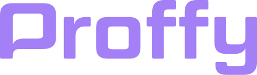
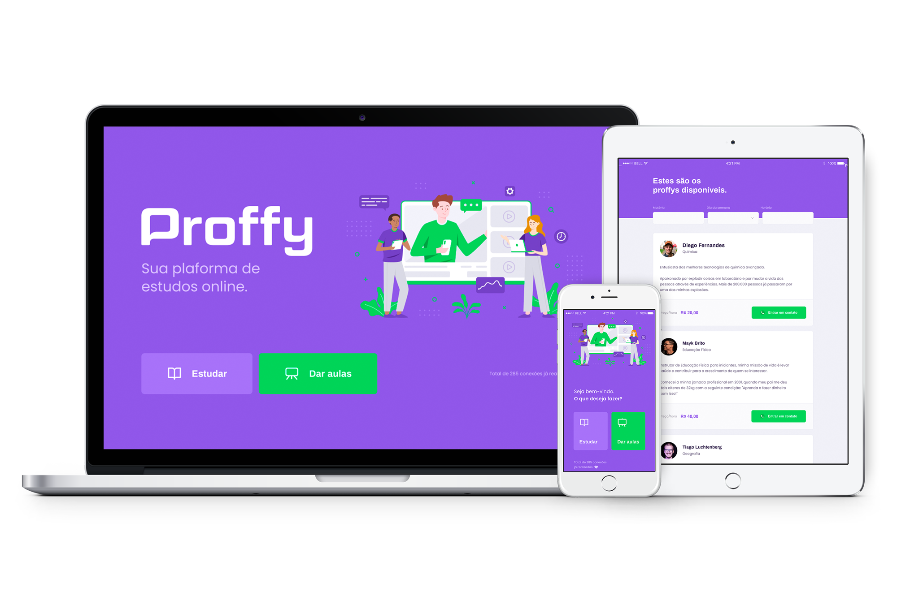

<h1 align="center">
    
</h1>

<h1 align="center">
  🚀 Next Level Week #2
</h4>

  

  
  
  

  

  <a href="#rocket-tecnologias"> :rocket: Tecnologias</a>&nbsp;&nbsp;&nbsp;|&nbsp;&nbsp;&nbsp;
  <a href="#-projeto">💻 Projeto</a>&nbsp;&nbsp;&nbsp;|&nbsp;&nbsp;&nbsp;

 

  

## :rocket: Tecnologias

Esse projeto foi desenvolvido com as seguintes tecnologias:

- [HTML](https://developer.mozilla.org/pt-BR/docs/Web/HTML/HTML5)
- [CSS](https://www.w3schools.com/css/)
- [Javascript](https://www.javascript.com/)
- [NodeJs](https://nodejs.org/en/)
- [SQLite](https://www.sqlite.org/index.html)
## 💻 Projeto
NLW #2 foi uma maratona incrível de aprendizado sobre a stack JS, criamos uma aplicação onde professores cadastram seus horários para aulas particulares, e alunos procuram as aulas específicas que preferem em dias e horários especificos.
